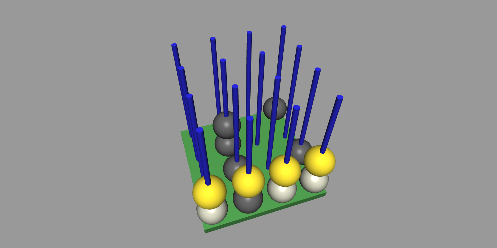
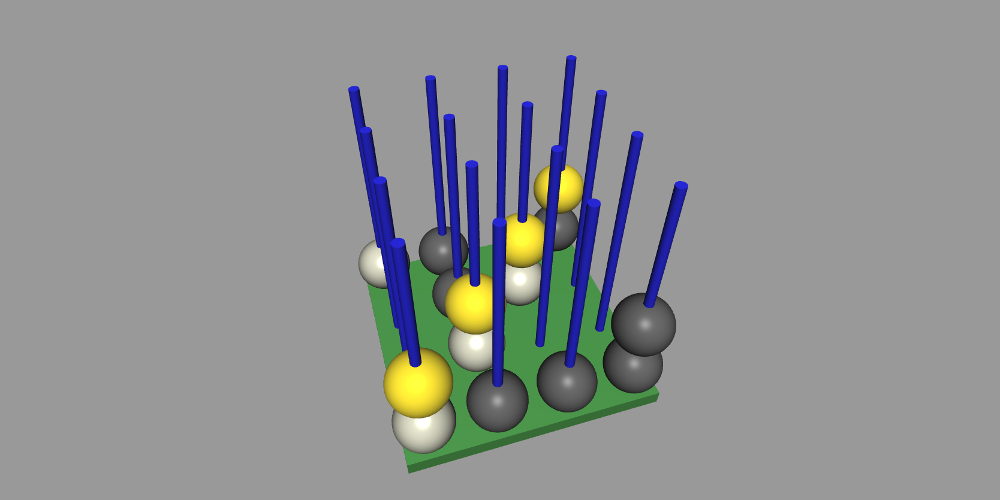
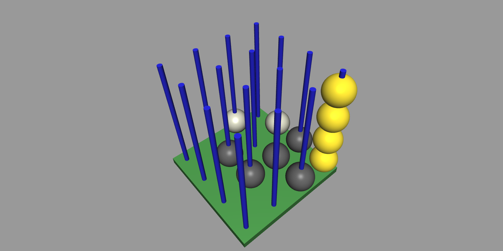
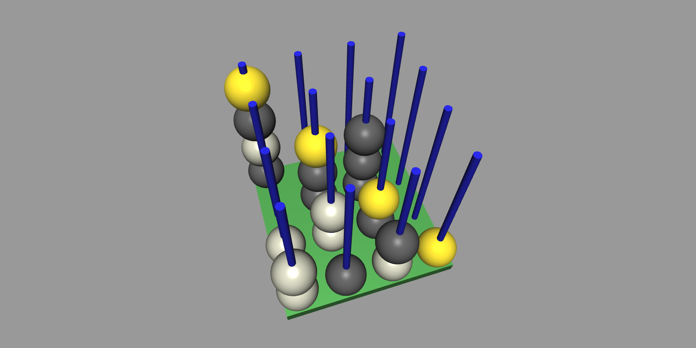

# 3D-Tic-Tac-Toe-4lines
「立体四目並べ」をPython上で行うためのPythonのソースコード```main.py```です。  
この作品はCC BY-NC-ND 4.0に基づいてライセンスされています。  
（表示 - 非営利 - 改変禁止 4.0 国際）  
https://creativecommons.org/licenses/by-nc-nd/4.0/    
なお、このソースコードを大学等の教育機関におけるいわゆる「課題」などに利用するために、一部またはそのすべてを用いたり、改変した作品を制作することを固く禁じる。

## 作品の概要
主に木でできた黒色と白色の球を用いて行う「立体四目並べ」をPython上で行うゲームである．プレイヤーは2人で対戦し，石を置く位置を交互に入力する．勝ちとの判定される条件を満たした場合にどちらのプレイヤーの価値化を自動で判定し，ゲームを終了する．

## 作品のオリジナルな点（工夫した点）
「立体四目並べ」自体は既に存在するものではあるが，これをPython上で実行するプログラムを作成するにあたり，他の作品や課題を元にしていないため，オリジナルであると考えられる．「立体四目並べ」を題材とした理由としては，勝ちと判定される条件が複数あり，これらの検証を行うにあたってプログラムの書きがいがあると考えたためである．勝ちと判定される条件については下記「作品の内容」に後述した．

工夫した点をを以下に挙げる．
- 入力された座標に対する処理
    - 範囲外の座標が入力された場合にはプログラムを終了する仕様とした．
    - 異常な入力（例：,（カンマ）が含まれていない）を検出した際もプログラムを終了する仕様とした．
    - (0,0)を入力することでゲームを終了できる仕様とした．
- プレイヤーの判定
    - 2人のプレイヤーが交互に入力する必要があるため，変数を用いてこれを管理した．
-  ゲーム終了および勝ったプレイヤーの条件判定部分
    - 勝ちと判定される条件は「縦，横，斜めいずれかの方向に4つの同じ色の石が並ぶこと」であるが，これを機械的に処理するために判定部分を13個に分けて構築．検証した．なおこの箇条書きの番号を以下「パターン番号」として呼ぶ．これは ```main.py``` に含まれる各検証部分の冒頭に添えたコメントアウトの番号と対応している．

    1. 同一段内における判定
       1. 行方向
       2. 列方向
       3. 斜め方向
          1. (行,列) = (1,1) と (4,4) の間
          2. (行,列) = (1,4) と (4,1) の間
    2. 同一位置，段違い時の判定
    3. 異なる位置，複数の段を経由する場合の判定（xは1から4の任意の整数値を取る）
       1.  (段,行,列) = (4,4,x) から (1,1,x) 方向
       2.  (段,行,列) = (4,1,x) から (1,4,x) 方向
       3.  (段,行,列) = (4,x,4) から (1,x,1) 方向
       4.  (段,行,列) = (4,x,1) から (1,x,4) 方向
       5.  (段,行,列) = (4,4,4) から (1,1,1) 方向
       6.  (段,行,列) = (4,1,1) から (1,4,4) 方向
       7.  (段,行,列) = (4,4,1) から (1,1,4) 方向
       8.  (段,行,列) = (4,1,4) から (1,4,1) 方向
    - ここで，**検証パターン2および3は，4段目に石が1個も置かれていない場合は検証する必要がない**（検証パターン2および3は4段目に少なくとも一つ石が置かれていないと条件を満たさない）．そこで，**検証パターン2および3に進入する前に4段目の配列の要素を確認し，配列の要素が全て0の場合は検証パターン2および3に進入しない仕様**とした．これにより実行時間の短縮が図ることができると考えている．4段目の配列の要素を検証する部分のプログラムの抜粋を以下に示す．
    ```py
    # 4段目の要素が全て0かどうかを検証する部分
    layer4_judge = 0 # 4段目の要素が全て0かどうか検証する際に使用するフラグ
    for m in range(4): # 行方向検証
        for n in range (4): # 列方向検証
            if (layer4[m][n] != 0): # 0以外なら
                layer4_judge = 1 # フラグ更新
                break # ループ脱出
    ```
- 乱数生成を用いた動作確認および検証
  - プログラムの冒頭にもコメントアウトしたが，このプログラムでは，動作テストを手動で100回ほど行い，正常な動作が見込めることを確認済である．また，乱数生成を用いた動作確認および検証も行った．この理由としては，乱数生成を用いた方が，手入力する場合の石の置き方よりもはるかに多くの石の置き方に対して検証が可能であり，これを短時間で行うことができると考えたためである．また，手数が多くなった場合の検証が正常に動作するかの確認を短い時間でできると考えたためである．  
  なお，下記の一部の動作例を作成するにあたって，乱数を生成することにより自動的にこのプログラムを進行して結果を出力し，これを動作例として用いた．数字を手動で入力する部分を，乱数を用いて自動的に入力したが，それ以外のコードの内容は一切変更していないため，乱数を用いたことによる，出力結果や検証結果の差異は無いと考えている．  
  乱数生成を用いてこのプログラムをテストする方法を以下に記す．
    - まず，プログラム冒頭で ```random``` モジュールをインポートする（コメントアウトを解除する）．
      ```py
      # 検証用の random モジュール
      import random
      ```
    - 次に，ゲーム用入力部分を無効化し，乱数生成を用いたテスト部分を有効化し，以下のようにプログラムを修正する．これにより乱数生成を用いた動作テストを行うことが可能である．
      ```py
      # 乱数生成を用いたテストを有効にする場合，冒頭の import random を有効化し，
      # ゲーム用入力部分を無効化して乱数生成を用いたテスト部分を有効化することで動作する．
      """
      # ゲーム用入力部分ここから
      put_position = input("石を置く位置を入力してください．(例:1,2)終了する場合は(0,0)を入力してください>") # 石の位置の入力を求める
      
      # カンマが含まれているかの検証
      if "," in put_position:
          x,y = map(int, put_position.split(',')) # 入力された石の位置を,を検出してx,yに代入する
      else: # カンマが含まれていない（入力形式が異なる）とき
          print("カンマが検出できませんでした．ゲームを終了します．")
          exit()
      # ゲーム用入力部分ここまで
      """
      
      # 乱数生成を用いたテスト部分ここから
      x = random.randint(1, 4)
      y = random.randint(1, 4)
      # 乱数生成を用いたテスト部分ここまで
      ```

## 完成状況について
このゲームは完成しており，正常に動作すると考えている．  

## 使用した技術の名称やツール名
- Anaconda 23.9.0
- Python 3.8.18
- Microsoft Visual Studio Code 1.85.1

## 動作環境
- OS
    - Windows 11 Home
- 実行環境
    - Anaconda 23.9.0
    - Python 3.8.18
    - Microsoft Visual Studio Code 1.85.1

## 作品の内容
### 実行方法
この ```README.md``` と同一のディレクトリに含まれる ```main.py``` を実行することで，ゲームが開始される．
### 立体四目並べのルールについて
このプログラムでは，二人のプレイヤーが交互に石を置いて，立体四目並べを行うことを想定している．以下にこのプログラムに沿った立体四目並べのルールを示す．
- まず，このプログラムは先手をプレイヤー1，後手をプレイヤー2としている．
- このプログラムを実行すると，以下のように表示される．
  ```
  立体四目ゲーム!

  ---プレイヤー1 記号:@ のターン---
  1手目
  石を置く位置を入力してください(例:1,2)．終了する場合は(0,0)を入力してください．>
  ```
- 先手：プレイヤー1は石を置く位置を入力する．以下，このプログラムでは**石を置く位置を行，列，段を用いて表現**する．プレイヤーは石を置く行と列のみを選択できる．**行，列ともに1,2,3,4の整数値で，半角カンマ（,）で区切って入力**する．
  - ここで，立体四目並べのルールとして**空中に石を配置することはできない**．そのため段数に関しては，**石を置こうとしている行，列の最も低い段数に自動的に石が置かれる**．
- 例として3行目，4列目に石を置くことを考える．この場合，次のように入力する．
  ```
  立体四目ゲーム!

  ---プレイヤー1 記号:@ のターン---
  1手目
  石を置く位置を入力してください(例:1,2)．終了する場合は(0,0)を入力してください．>3,4
  ```
- 以下のように出力される
  ```
  石を(1段目, 3行目, 4列目)に置きました．

  ---現在の状況---
  ---凡例---
  -プレイヤー1：@
  -プレイヤー2：O
  -石が置かれていない場所：_
  -現在1手目

  【1段目】
    1234 列
  1 ____
  2 ____
  3 ___@
  4 ____
  行
  【2段目】
    1234 列
  1 ____
  2 ____
  3 ____
  4 ____
  行
  【3段目】
    1234 列
  1 ____
  2 ____
  3 ____
  4 ____
  行
  【4段目】
    1234 列
  1 ____
  2 ____
  3 ____
  4 ____
  行


  ---プレイヤー2 記号:O のターン---
  2手目
  石を置く位置を入力してください(例:1,2)．終了する場合は(0,0)を入力してください．>
  ```
- これにより，1段目の3行目4列目にプレイヤー1の石（@）が置かれたことになる．
- 自動的にプレイヤー2のターンとなり，以後，どちらかのプレイヤーが条件を満たしてゲームが終わるまで上記のように交互に石を置く．条件を満たした場合はその条件を出力し終了する．ただし，一度も条件を満たすことなく64個の石が置かれた場合は，決着がつかなかった旨を表示し，終了する．

### 勝ちと判定される並べ方（パターン）について
ここからは勝ちと判定される場合の条件について，いくつかのパターンに分けて説明する．作品のオリジナルな点（工夫した点）で記した判定パターンの該当する番号を示す．
1. 同一平面内で行または列を揃えた場合（判定パターン1.1および1.2）
   
2. 同一平面内で斜めにそろえた場合（判定パターン1.3）
   
3. 同一位置で他の段でそろえた場合（判定パターン2）
   
4. 異なる位置で複数段をまたいでそろえた場合（判定パターン3）
   

この4つのパターンのいずれかに該当した場合，これに該当する種の石を置いたプレイヤーを勝ちと判定し，ゲームは終了する．
## 動作例及び動作例に対する妥当性の考察
上記，「作品のオリジナルな点（工夫した点）」に記した13パターンの場合の動作例（最終的な判定部分）およびこの検証に用いたプログラムの抜粋をそれぞれ以下に示す．
1. 同一段内における判定
    1. 行方向
        ```
        ---プレイヤー1 記号:@ のターン---
        25手目
        石を置く位置を入力してください(例:1,2)．終了する場合は(0,0)を入力してください．>2,1
        石を(1段目, 2行目, 1列目)に置きました．

        ---現在の状況---
        ---凡例---
        -プレイヤー1：@
        -プレイヤー2：O
        -石が置かれていない場所：_
        -現在25手目

        【1段目】
          1234 列
        1 @O_@
        2 @@@@
        3 @OO_
        4 O@O_
        行
        【2段目】
          1234 列
        1 _O_O
        2 ___@
        3 @_O_
        4 O_@_
        行
        【3段目】
          1234 列
        1 _O__
        2 ___@
        3 __O_
        4 @___
        行
        【4段目】
          1234 列
        1 ____
        2 ___O
        3 ____
        4 ____
        行

        1段目の2行目が揃いました！25手でプレイヤー1の勝ち！
        ゲームを終了します
        ```
        ```py
        # 同一段内，行方向に4個ならんでいるかを検証
            # README.md における対応 1.1
            for l in range(1,5):
                nowlayer = globals()['layer' + str(l)] # 検索対象の配列を定義
                for m in range(4):
                    player1 = 0 # 条件を満たす石のカウンターを定義
                    player2 = 0
                    for n in range(4):
                        if (nowlayer[m][n] == 1): 
                            player1 = player1 + 1
                        if (nowlayer[m][n] == 2):
                            player2 = player2 + 1
                    if (player1 == 4): # 条件を満たす石の個数が4個の場合
                        print("{}段目の{}行目が揃いました！{}手でプレイヤー1の勝ち！\nゲームを終了します".format(l,m+1,stone))
                        exit()
                    if (player2 == 4):
                        print("{}段目の{}行目が揃いました！{}手でプレイヤー2の勝ち！\nゲームを終了します".format(l,m+1,stone))
                        exit()
        ```
        出力結果より，直前に石を置いた位置を含む形で，条件を満たす並びを形成したと考えられるため，この出力や検証は妥当であると言える．また，この盤面を確認すると，他に条件を満たしたならび方は形成されていないため，ゲームとして正常に動作していると言える．
    2. 列方向
        ```
        ---プレイヤー1 記号:@ のターン---
        31手目
        石を置く位置を入力してください(例:1,2)．終了する場合は(0,0)を入力してください．>2,3
        石を(2段目, 2行目, 3列目)に置きました．

        ---現在の状況---
        ---凡例---
        -プレイヤー1：@
        -プレイヤー2：O
        -石が置かれていない場所：_
        -現在31手目

        【1段目】
          1234 列
        1 @@OO
        2 OO@O
        3 @_@@
        4 @@OO
        行
        【2段目】
          1234 列
        1 O_@_
        2 OO@_
        3 @_@@
        4 O_@O
        行
        【3段目】
          1234 列
        1 __@_
        2 _O__
        3 ___O
        4 __O_
        行
        【4段目】
          1234 列
        1 __@_
        2 ____
        3 ____
        4 ____
        行

        2段目の3列目が揃いました！31手でプレイヤー1の勝ち！
        ゲームを終了します
        ```
        ```py
        # 同一段内，列方向に4個ならんでいるか検証
        # README.md における対応 1.2
        for l in range(1,5):
            nowlayer = globals()['layer' + str(l)] # 検索対象の配列を定義
            for m in range(4):
                player1 = 0 # 条件を満たす石のカウンターを定義
                player2 = 0
                for n in range(4):
                    if (nowlayer[n][m] == 1):
                        player1 = player1 + 1
                    if (nowlayer[n][m] == 2):
                        player2 = player2 + 1
                if (player1 == 4): # 条件を満たす石の個数が4個の場合
                    print("{}段目の{}列目が揃いました！{}手でプレイヤー1の勝ち！\nゲームを終了します".format(l,m+1,stone))
                    exit()
                if (player2 == 4):
                    print("{}段目の{}列目が揃いました！{}手でプレイヤー2の勝ち！\nゲームを終了します".format(l,m+1,stone))
                    exit()
        ```
        出力結果より，直前に石を置いた位置を含む形で，条件を満たす並びを形成したと考えられるため，この出力や検証は妥当であると言える．また，この盤面を確認すると，他に条件を満たしたならび方は形成されていないため，ゲームとして正常に動作していると言える．
    3. 斜め方向
       1. (行,列) = (1,1) と (4,4) の間
          ```
          ---プレイヤー1 記号:@ のターン---
          21手目
          石を置く位置を入力してください(例:1,2)．終了する場合は(0,0)を入力してください．>3,3
          石を(1段目, 3行目, 3列目)に置きました．

          ---現在の状況---
          ---凡例---
          -プレイヤー1：@
          -プレイヤー2：O
          -石が置かれていない場所：_
          -現在21手目

          【1段目】
            1234 列
          1 @OO@
          2 @@O_
          3 _@@O
          4 OO_@
          行
          【2段目】
            1234 列
          1 O@__
          2 __O_
          3 _@__
          4 @O_O
          行
          【3段目】
            1234 列
          1 ____
          2 ____
          3 _@__
          4 ____
          行
          【4段目】
            1234 列
          1 ____
          2 ____
          3 ____
          4 ____
          行

          1段目で斜め（\）に揃いました！21手でプレイヤー1の勝ち！
          ゲームを終了します
          ```
          ```py
          # 同一平面内，斜め方向に4個ならんでいるか検証
          # README.md における対応 1.3.1
          for l in range (1,5):
              nowlayer = globals()['layer' + str(l)]
              player1 = 0
              player2 = 0
              for m in range(4):
                  if (nowlayer[m][m] == 1):
                      player1 = player1 + 1
                  if (nowlayer[m][m] == 2):
                      player2 = player2 + 1
              if (player1 == 4):
                  print("{}段目で斜め（\）に揃いました！{}手でプレイヤー1の勝ち！\nゲームを終了します".format(l,stone))
                  exit()
              if (player2 == 4):
                  print("{}段目で斜め（\）に揃いました！{}手でプレイヤー2の勝ち！\nゲームを終了します".format(l,stone))
                  exit()
          ```
       2. (行,列) = (1,4) と (4,1) の間
          ```
          ---プレイヤー1 記号:@ のターン---
          23手目
          石を置く位置を入力してください(例:1,2)．終了する場合は(0,0)を入力してください．>1,4
          石を(1段目, 1行目, 4列目)に置きました．

          ---現在の状況---
          ---凡例---
          -プレイヤー1：@
          -プレイヤー2：O
          -石が置かれていない場所：_
          -現在23手目

          【1段目】
            1234 列
          1 @_@@
          2 O_@O
          3 O@O@
          4 @O@O
          行
          【2段目】
            1234 列
          1 @___
          2 O__O
          3 @_@@
          4 ___O
          行
          【3段目】
            1234 列
          1 ____
          2 ____
          3 O_O_
          4 ____
          行
          【4段目】
            1234 列
          1 ____
          2 ____
          3 ____
          4 ____
          行

          1段目で斜め（/）に揃いました！23手でプレイヤー1の勝ち！
          ゲームを終了します
          ```
          ```py
          # 同一平面内，斜め方向に4個ならんでいるか検証
          # README.md における対応 1.3.2
          for l in range (1,5):
              nowlayer = globals()['layer' + str(l)]
              player1 = 0
              player2 = 0
              for m in range(4):
                  if (nowlayer[m][3-m] == 1):
                      player1 = player1 + 1
                  if (nowlayer[m][3-m] == 2):
                      player2 = player2 + 1
              if (player1 == 4):
                  print("{}段目で斜め（/）に揃いました！{}手でプレイヤー1の勝ち！\nゲームを終了します".format(l,stone))
                  exit()
              if (player2 == 4):
                  print("{}段目で斜め（/）に揃いました！{}手でプレイヤー2の勝ち！\nゲームを終了します".format(l,stone))
                  exit()
          ```
        出力結果より，直前に石を置いた位置を含む形で，条件を満たす並びを形成したと考えられるため，この出力や検証は妥当であると言える．また，この盤面を確認すると，他に条件を満たしたならび方は形成されていないため，ゲームとして正常に動作していると言える．なおここでは斜めの向きを2種類に分けて検証したが，この方向と出力も合致しているため，この検証結果および動作は妥当であると考えている．  

ここから先の検証での条件について考えると，4段目に少なくとも1つ石が置かれている必要があるといえる．よって，4段目の状態を管理する配列 ```layer4``` の内部の要素が全て0の場合はこの先の検証を行わない仕様となっている． ```layer4``` の配列の要素のうち，少なくとも1つが1または2である場合にのみ，この先の検証を行う．

2. 同一位置，段違い時の判定
    ```
    ---プレイヤー1 記号:@ のターン---
    19手目
    石を置く位置を入力してください(例:1,2)．終了する場合は(0,0)を入力してください．>4,1
    石を(4段目, 4行目, 1列目)に置きました．

    ---現在の状況---
    ---凡例---
    -プレイヤー1：@
    -プレイヤー2：O
    -石が置かれていない場所：_
    -現在19手目

    【1段目】
      1234 列
    1 @_OO
    2 OO_O
    3 @O_@
    4 @__@
    行
    【2段目】
      1234 列
    1 ____
    2 _O__
    3 _@_O
    4 @___
    行
    【3段目】
      1234 列
    1 ____
    2 ____
    3 _O_@
    4 @___
    行
    【4段目】
      1234 列
    1 ____
    2 ____
    3 ____
    4 @___
    行

    4行目1列目で段違いで揃いました！19手でプレイヤー1の勝ち！
    ゲームを終了します
    ```
    ```py
    # 同一位置，段違いで4個ならんでいるか検証
    # README.md における対応 2
    for m in range(4):
        for n in range(4):
            player1 = 0
            player2 = 0
            if (layer4[m][n] == 1):
                player1 = player1 + 1
                for l in range (3,0,-1):
                    nowlayer = globals()['layer' + str(l)]
                    if (nowlayer[m][n] == 1):
                        player1 = player1 + 1
                if (player1 == 4):
                    print("{}行目{}列目で段違いで揃いました！{}手でプレイヤー1の勝ち！\nゲームを終了します".format(m+1,n+1,stone))
                    exit()
            if (layer4[m][n] == 2):
                player2 = player2 + 1
                for l in range (3,0,-1):
                    nowlayer = globals()['layer' + str(l)]
                    if (nowlayer[m][n] == 2):
                        player2 = player2 + 1
                if (player2 == 4):
                    print("{}行目{}列目で段違いで揃いました！{}手でプレイヤー2の勝ち！\nゲームを終了します".format(m+1,n+1,stone))
                    exit()
    ```
    この条件を満たすためには，最後に置いた石の位置は必ず4段目である必要がある．この条件を満たしているためこの検証結果は妥当であるといえる．
3. 異なる位置，複数の段を経由する場合の判定（xは1から4の任意の整数値を取る）
    1.  (段,行,列) = (4,4,x) から (1,1,x) 方向
        ```
        ---プレイヤー1 記号:@ のターン---
        31手目
        石を置く位置を入力してください(例:1,2)．終了する場合は(0,0)を入力してください．>2,3
        石を(2段目, 2行目, 3列目)に置きました．

        ---現在の状況---
        ---凡例---
        -プレイヤー1：@
        -プレイヤー2：O
        -石が置かれていない場所：_
        -現在31手目

        【1段目】
          1234 列
        1 __@@
        2 @@O@
        3 @OOO
        4 @@O_
        行
        【2段目】
          1234 列
        1 ___O
        2 _O@@
        3 OOO_
        4 O@O_
        行
        【3段目】
          1234 列
        1 ____
        2 _@_@
        3 _O@_
        4 __O_
        行
        【4段目】
          1234 列
        1 ____
        2 ___O
        3 __@_
        4 __@_
        行

        4段目4行目3列目と1段目1行目3列目の間が揃いました！31手でプレイヤー1の勝ち！
        ゲームを終了します
        ```
        ```py
        # README.md における対応 3.1
        # 4段目4行目と1段目1行目間の検証：石が置かれているとき，異なる位置，複数の段を経由して4個ならんでいないか検証
        for judge_player in range (1,3):
            for m in range(4):
                if (layer1[0][m] ==  judge_player and layer2[1][m] == judge_player and layer3[2][m] == judge_player and layer4[3][m] == judge_player):
                    print("4段目4行目{}列目と1段目1行目{}列目の間が揃いました！{}手でプレイヤー{}の勝ち！\nゲームを終了します".format(m+1,m+1,stone,judge_player))
                    exit()
        ```
        出力結果より，直前に石を置いた位置を含む形で，条件を満たす並びを形成したと考えられるため，この出力や検証は妥当であると言える．また，この盤面を確認すると，他に条件を満たしたならび方は形成されていないため，ゲームとして正常に動作していると言える．
    2.  (段,行,列) = (4,1,x) から (1,4,x) 方向
        ```
        ---プレイヤー2 記号:O のターン---
        36手目
        石を置く位置を入力してください(例:1,2)．終了する場合は(0,0)を入力してください．>4,2
        石を(1段目, 4行目, 2列目)に置きました．

        ---現在の状況---
        ---凡例---
        -プレイヤー1：@
        -プレイヤー2：O
        -石が置かれていない場所：_
        -現在36手目

        【1段目】
          1234 列
        1 @@O_
        2 OOO@
        3 @@@_
        4 OOO@
        行
        【2段目】
          1234 列
        1 OO@_
        2 O@OO
        3 _O__
        4 O_@@
        行
        【3段目】
          1234 列
        1 _@__
        2 _O@@
        3 _@__
        4 O___
        行
        【4段目】
          1234 列
        1 _O__
        2 _@O_
        3 _@__
        4 @___
        行

        4段目1行目2列目と1段目4行目2列目の間が揃いました！36手でプレイヤー2の勝ち！
        ゲームを終了します
        ```
        ```PY
        # README.md における対応 3.2
        # 4段目1行目と1段目4行目間の検証：石が置かれているとき，異なる位置，複数の段を経由して4個ならんでいないか検証
        for judge_player in range (1,3):
            for m in range(4):
                if (layer1[3][m] ==  judge_player and layer2[2][m] == judge_player and layer3[1][m] == judge_player and layer4[0][m] == judge_player):
                    print("4段目1行目{}列目と1段目4行目{}列目の間が揃いました！{}手でプレイヤー{}の勝ち！\nゲームを終了します".format(m+1,m+1,stone,judge_player))
                    exit()
        ```
        出力結果より，直前に石を置いた位置を含む形で，条件を満たす並びを形成したと考えられるため，この出力や検証は妥当であると言える．また，この盤面を確認すると，他に条件を満たしたならび方は形成されていないため，ゲームとして正常に動作していると言える．
    3.  (段,行,列) = (4,x,4) から (1,x,1) 方向
        ```
        ---プレイヤー2 記号:O のターン---
        52手目
        石を置く位置を入力してください(例:1,2)．終了する場合は(0,0)を入力してください．>2,3
        石を(3段目, 2行目, 3列目)に置きました．

        ---現在の状況---
        ---凡例---
        -プレイヤー1：@
        -プレイヤー2：O
        -石が置かれていない場所：_
        -現在52手目

        【1段目】
          1234 列
        1 @O@_
        2 OO@O
        3 OO@O
        4 @@O@
        行
        【2段目】
          1234 列
        1 @@O_
        2 @OO@
        3 O_@@
        4 @O@O
        行
        【3段目】
          1234 列
        1 O_@_
        2 O@OO
        3 @_@O
        4 @O@_
        行
        【4段目】
          1234 列
        1 O_@_
        2 O@_O
        3 @_O@
        4 OO@_
        行

        4段目2行目4列目と1段目2行目1列目の間が揃いました！52手でプレイヤー2の勝ち！
        ゲームを終了します
        ```
        ```PY
        # README.md における対応 3.3
        # 4段目4列目と1段目1列目間の検証：石が置かれているとき，異なる位置，複数の段を経由して4個ならんでいないか検証
            for m in range(4):
                if (layer1[m][0] ==  judge_player and layer2[m][1] == judge_player and layer3[m][2] == judge_player and layer4[m][3] == judge_player):
                    print("4段目{}行目4列目と1段目{}行目1列目の間が揃いました！{}手でプレイヤー{}の勝ち！\nゲームを終了します".format(m+1,m+1,stone,judge_player))
                    exit()
        ```
        出力結果より，直前に石を置いた位置を含む形で，条件を満たす並びを形成したと考えられるため，この出力や検証は妥当であると言える．また，この盤面を確認すると，他に条件を満たしたならび方は形成されていないため，ゲームとして正常に動作していると言える．
    4.  (段,行,列) = (4,x,1) から (1,x,4) 方向
        ```
        ---プレイヤー2 記号:O のターン---
        20手目
        石を置く位置を入力してください(例:1,2)．終了する場合は(0,0)を入力してください．>3,1
        石を(4段目, 3行目, 1列目)に置きました．

        ---現在の状況---
        ---凡例---
        -プレイヤー1：@
        -プレイヤー2：O
        -石が置かれていない場所：_
        -現在20手目

        【1段目】
          1234 列
        1 O@@_
        2 @@O_
        3 OO@O
        4 @__@
        行
        【2段目】
          1234 列
        1 __O_
        2 ____
        3 O@O@
        4 ____
        行
        【3段目】
          1234 列
        1 ____
        2 ____
        3 @O__
        4 ____
        行
        【4段目】
          1234 列
        1 ____
        2 ____
        3 O___
        4 ____
        行

        4段目3行目1列目と1段目3行目4列目の間が揃いました！20手でプレイヤー2の勝ち！
        ゲームを終了します
        ```
        ```PY
        # README.md における対応 3.4
        # 4段目1列目と1段目4列目間の検証：石が置かれているとき，異なる位置，複数の段を経由して4個ならんでいないか検証
        for judge_player in range (1,3):
            for m in range(4):
                if (layer1[m][3] ==  judge_player and layer2[m][2] == judge_player and layer3[m][1] == judge_player and layer4[m][0] == judge_player):
                    print("4段目{}行目1列目と1段目{}行目4列目の間が揃いました！{}手でプレイヤー{}の勝ち！\nゲームを終了します".format(m+1,m+1,stone,judge_player))
                    exit()
        ```
        出力結果より，直前に石を置いた位置を含む形で，条件を満たす並びを形成したと考えられるため，この出力や検証は妥当であると言える．また，この盤面を確認すると，他に条件を満たしたならび方は形成されていないため，ゲームとして正常に動作していると言える．
    5.  (段,行,列) = (4,4,4) から (1,1,1) 方向
        ```
        ---プレイヤー2 記号:O のターン---
        38手目
        石を置く位置を入力してください(例:1,2)．終了する場合は(0,0)を入力してください．>4,4
        石を(4段目, 4行目, 4列目)に置きました．

        ---現在の状況---
        ---凡例---
        -プレイヤー1：@
        -プレイヤー2：O
        -石が置かれていない場所：_
        -現在38手目

        【1段目】
          1234 列
        1 OOO@
        2 O@@@
        3 @_O_
        4 @OO@
        行
        【2段目】
          1234 列
        1 _O@O
        2 _OOO
        3 @_@_
        4 @@O@
        行
        【3段目】
          1234 列
        1 _O__
        2 _O__
        3 O_O_
        4 _O@@
        行
        【4段目】
          1234 列
        1 _@__
        2 ____
        3 @_@_
        4 __@O
        行

        4段目4行目4列と1段目1行目1列の間が揃いました！38手でプレイヤー2の勝ち！
        ゲームを終了します
        ```
        ```PY
        for judge_player in range (1,3):
            # README.md における対応 3.5
            # 4段目4行目4列と1段目1行目1列の検証：石が置かれているとき，異なる位置，複数の段を経由して4個ならんでいないか検証
            if (layer1[0][0] == judge_player and layer4[3][3] == judge_player):
                if (layer2[1][1] == judge_player and layer3[2][2] == judge_player):
                    print("4段目4行目4列と1段目1行目1列の間が揃いました！{}手でプレイヤー{}の勝ち！\nゲームを終了します".format(stone,judge_player))
                    exit()
        ```
        出力結果より，直前に石を置いた位置を含む形で，条件を満たす並びを形成したと考えられるため，この出力や検証は妥当であると言える．また，この盤面を確認すると，他に条件を満たしたならび方は形成されていないため，ゲームとして正常に動作していると言える．
    6.  (段,行,列) = (4,1,1) から (1,4,4) 方向
        ```
        ---プレイヤー2 記号:O のターン---
        12手目
        石を置く位置を入力してください(例:1,2)．終了する場合は(0,0)を入力してください．>4,4
        石を(1段目, 4行目, 4列目)に置きました．

        ---現在の状況---
        ---凡例---
        -プレイヤー1：@
        -プレイヤー2：O
        -石が置かれていない場所：_
        -現在12手目

        【1段目】
          1234 列
        1 @___
        2 @@__
        3 __@_
        4 ___O
        行
        【2段目】
          1234 列
        1 O___
        2 @O__
        3 __O_
        4 ____
        行
        【3段目】
          1234 列
        1 @___
        2 _O__
        3 ____
        4 ____
        行
        【4段目】
          1234 列
        1 O___
        2 ____
        3 ____
        4 ____
        行

        1段目4行目4列と4段目1行目1列の間が揃いました！12手でプレイヤー2の勝ち！
        ゲームを終了します
        ```
        ```PY
        for judge_player in range (1,3):
            # README.md における対応 3.6
            # 4段目1行目1列と1段目4行目4列間の検証：石が置かれているとき，異なる位置，複数の段を経由して4個ならんでいないか検証
            elif (layer1[3][3] == judge_player and layer4[0][0] == judge_player):
                if (layer2[2][2] == judge_player and layer3[1][1] == judge_player):
                    print("4段目1行目1列と1段目4行目4列の間が揃いました！{}手でプレイヤー{}の勝ち！\nゲームを終了します".format(stone,judge_player))
                    exit()
        ```
        出力結果より，直前に石を置いた位置を含む形で，条件を満たす並びを形成したと考えられるため，この出力や検証は妥当であると言える．また，この盤面を確認すると，他に条件を満たしたならび方は形成されていないため，ゲームとして正常に動作していると言える．
    7.  (段,行,列) = (4,4,1) から (1,1,4) 方向
        ```
        ---プレイヤー1 記号:@ のターン---
        35手目
        石を置く位置を入力してください(例:1,2)．終了する場合は(0,0)を入力してください．>3,2
        石を(3段目, 3行目, 2列目)に置きました．

        ---現在の状況---
        ---凡例---
        -プレイヤー1：@
        -プレイヤー2：O
        -石が置かれていない場所：_
        -現在35手目

        【1段目】
          1234 列
        1 __@@
        2 @OO@
        3 @@O@
        4 @OOO
        行
        【2段目】
          1234 列
        1 ___O
        2 O_@_
        3 @@OO
        4 O@_O
        行
        【3段目】
          1234 列
        1 ___@
        2 O_@_
        3 @@O_
        4 OO__
        行
        【4段目】
          1234 列
        1 ___O
        2 ____
        3 ____
        4 @@__
        行

        4段目4行目1列と1段目1行目4列の間が揃いました！35手でプレイヤー1の勝ち！
        ゲームを終了します
        ```
        ```PY
        for judge_player in range (1,3):
            # README.md における対応 3.7
            # 4段目4行目1列と1段目1行目4列間の検証：石が置かれているとき，異なる位置，複数の段を経由して4個ならんでいないか検証
            elif (layer1[0][3] == judge_player and layer4[3][0] == judge_player):
                if (layer2[1][2] == judge_player and layer3[2][1] == judge_player):
                    print("4段目4行目1列と1段目1行目4列の間が揃いました！{}手でプレイヤー{}の勝ち！\nゲームを終了します".format(stone,judge_player))
                    exit()
        ```
        出力結果より，直前に石を置いた位置を含む形で，条件を満たす並びを形成したと考えられるため，この出力や検証は妥当であると言える．また，この盤面を確認すると，他に条件を満たしたならび方は形成されていないため，ゲームとして正常に動作していると言える．
    8.  (段,行,列) = (4,1,4) から (1,4,1) 方向
        ```
        ---プレイヤー2 記号:O のターン---
        24手目
        石を置く位置を入力してください(例:1,2)．終了する場合は(0,0)を入力してください．>1,4
        石を(4段目, 1行目, 4列目)に置きました．

        ---現在の状況---
        ---凡例---
        -プレイヤー1：@
        -プレイヤー2：O
        -石が置かれていない場所：_
        -現在24手目

        【1段目】
          1234 列
        1 O_@@
        2 _@O@
        3 _@O@
        4 O_@O
        行
        【2段目】
          1234 列
        1 __OO
        2 __@@
        3 _O__
        4 @__O
        行
        【3段目】
          1234 列
        1 __@@
        2 __O_
        3 ____
        4 ____
        行
        【4段目】
          1234 列
        1 ___O
        2 __O_
        3 ____
        4 ____
        行

        4段目1行目4列と1段目4行目1列の間が揃いました！24手でプレイヤー2の勝ち！
        ゲームを終了します
        ```
        ```PY
        for judge_player in range (1,3):
            # README.md における対応 3.8
            # 4段目1行目4列と1段目4行目1列間の検証：石が置かれているとき，異なる位置，複数の段を経由して4個ならんでいないか検証
            elif (layer1[3][0] == judge_player and layer4[0][3] == judge_player):
                if (layer2[2][1] == judge_player and layer3[1][2] == judge_player):
                    print("4段目1行目4列と1段目4行目1列の間が揃いました！{}手でプレイヤー{}の勝ち！\nゲームを終了します".format(stone,judge_player))
                    exit()
        ```
        出力結果より，直前に石を置いた位置を含む形で，条件を満たす並びを形成したと考えられるため，この出力や検証は妥当であると言える．また，この盤面を確認すると，他に条件を満たしたならび方は形成されていないため，ゲームとして正常に動作していると言える．

なお，上記の検証により条件を満たすならびが検出された場合は，ゲームはその時点で終了となる．しかし，どのならびも検出されることなく，かつ，すべての石が置かれた場合は，決着がつかなかった旨を表示してゲームは終了する．その際の表示とプログラムの抜粋を以下に記す．
```
---プレイヤー2 記号:O のターン---
64手目
石を置く位置を入力してください(例:1,2)．終了する場合は(0,0)を入力してください．>4,1
石を(4段目, 4行目, 1列目)に置きました．

---現在の状況---
---凡例---
-プレイヤー1：@
-プレイヤー2：O
-石が置かれていない場所：_
-現在64手目

【1段目】
  1234 列
1 @@OO
2 OO@@
3 @@OO
4 OO@@
行
【2段目】
  1234 列
1 OO@@
2 @@OO
3 OO@@
4 @@OO
行
【3段目】
  1234 列
1 @@OO
2 OO@@
3 @@OO
4 OO@@
行
【4段目】
  1234 列
1 @@OO
2 OO@@
3 @@OO
4 OO@@
行

全ての石が置かれました，決着がつきませんでした．
ゲームを終了します
```
```PY
# ゲーム継続中に繰り返すための処理，全部石が埋まったら終了
while stone != 64:
    # このwhile文の内部で上に記した検証を行う

# （中略）

# 全ての石が置かれ，かつ決着がつかなかった場合の動作
if (stone == 64):
    print("全ての石が置かれました，決着がつきませんでした．\nゲームを終了します")
    exit()
```
## 参考文献
「勝ちと判定される並べ方（パターン）について」で用いた画像は，以下のサイトで立体四目並べを行うことで得た．  
福岡工業大学作田研究室, "ScoreFourの公開ページ", 作田研究室, 2019, https://www.fit.ac.jp/~sakuta/scorefour/scorefour.ja.html, 参照(2023-12-26)